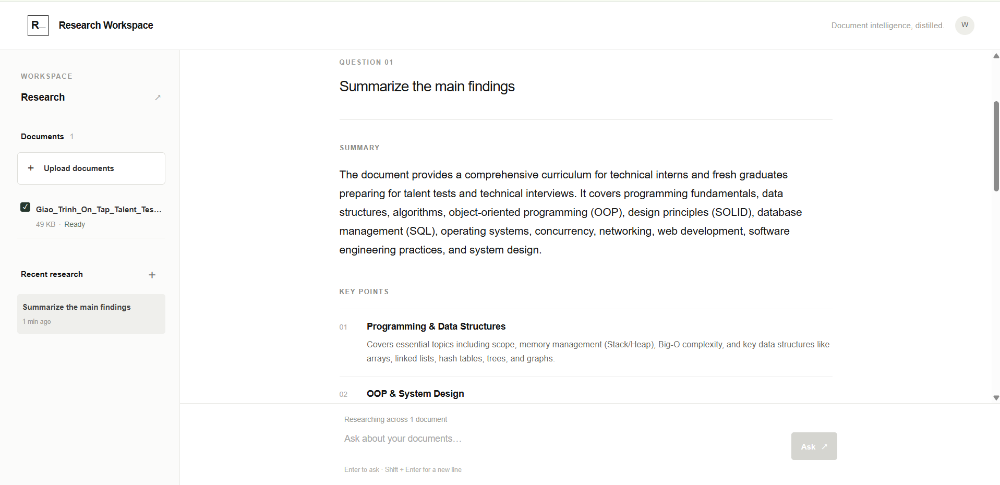
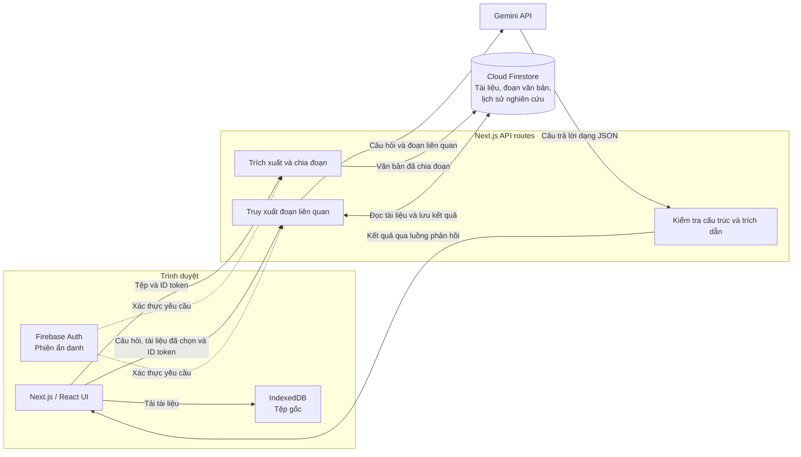

# Research Workspace

**Không gian nghiên cứu tài liệu với AI.** Tải tài liệu lên, chọn nguồn cần phân tích và đặt câu hỏi. Ứng dụng tổng hợp câu trả lời có cấu trúc, kèm trích đoạn bằng chứng từ chính tài liệu của bạn.



## Tính năng

- **Nghiên cứu theo tài liệu:** hỗ trợ PDF, DOCX, TXT và Markdown; chọn một hoặc nhiều tài liệu cho mỗi câu hỏi.
- **Câu trả lời có bằng chứng:** Gemini tạo phần tóm tắt, ý chính, trích dẫn, rủi ro và bước tiếp theo. Trích dẫn được đối chiếu với văn bản đã trích xuất trước khi hiển thị.
- **Lịch sử làm việc:** lưu câu hỏi và kết quả, xem lại nghiên cứu gần đây, tạo lại câu trả lời và sao chép nội dung.
- **Giao diện thích ứng:** sử dụng trên máy tính và thiết bị di động.

## Kiến trúc



**Luồng tài liệu:** API route nhận tệp, trích xuất văn bản và chia thành các đoạn có thể tìm kiếm. Tệp gốc được lưu trong IndexedDB của trình duyệt tải lên; Firestore lưu thông tin tài liệu và các đoạn văn bản.

**Luồng nghiên cứu:** API route lấy các đoạn liên quan từ những tài liệu đã chọn, gửi ngữ cảnh tới Gemini, kiểm tra câu trả lời theo schema và xác minh trích dẫn khớp với nguồn. Kết quả được truyền dần về giao diện và lưu vào Firestore cùng lịch sử câu hỏi.

**Quyền truy cập:** Firebase Authentication cấp phiên ẩn danh. Firestore Security Rules giới hạn dữ liệu theo ID người dùng; Gemini API key chỉ được dùng trong API route phía máy chủ.

## Công nghệ

| Thành phần | Công nghệ | Vai trò |
| --- | --- | --- |
| Giao diện và API | Next.js App Router, React, TypeScript | Giao diện, xử lý tải tệp và nghiên cứu |
| Kiểu dáng | Tailwind CSS | Giao diện thích ứng |
| Xác thực và dữ liệu | Firebase Authentication, Cloud Firestore | Phiên người dùng, tài liệu và lịch sử |
| AI | Gemini API | Tổng hợp câu trả lời từ nội dung tài liệu |
| Xử lý tài liệu | `pdf-parse`, `mammoth` | Trích xuất văn bản PDF và DOCX |

## Bắt đầu

**Yêu cầu:** Node.js 20 trở lên, pnpm 10, dự án Firebase và Gemini API key.

1. Trong Firebase, bật **Anonymous Authentication**, tạo **Cloud Firestore** và đăng ký một ứng dụng Web.
2. Tạo tệp môi trường từ mẫu:

   ```bash
   cp .env.example .env.local
   ```

   Điền thông tin Firebase Web SDK vào các biến `NEXT_PUBLIC_FIREBASE_*`, điền project ID vào `FIREBASE_PROJECT_ID` và Gemini API key vào `GEMINI_API_KEY`. Có thể đổi `GEMINI_MODEL` nếu cần.

3. Triển khai [Firestore Security Rules](firestore.rules):

   ```bash
   firebase deploy --only firestore:rules --project YOUR_PROJECT_ID
   ```

4. Cài đặt và chạy ứng dụng:

   ```bash
   corepack pnpm install
   corepack pnpm dev
   ```

Mở [http://localhost:3000](http://localhost:3000). Để chạy bản production, dùng `corepack pnpm build` rồi `corepack pnpm start`.

## Triển khai với GitHub và Render

Repository có [GitHub Actions CI](.github/workflows/ci.yml) để cài dependency, kiểm tra TypeScript và build trên mỗi push hoặc pull request vào `main`. [Render Blueprint](render.yaml) cấu hình một **Web Service miễn phí tại Singapore** và tự triển khai commit mới trên `main` sau khi CI thành công.

1. Trong Render Dashboard, kết nối tài khoản GitHub và cấp quyền truy cập repository này. Tạo **New → Blueprint**, chọn repository và nhánh `main` để Render đọc `render.yaml`.
2. Điền các biến `NEXT_PUBLIC_FIREBASE_*`, `FIREBASE_PROJECT_ID` và `GEMINI_API_KEY` khi Render yêu cầu. Dùng cùng giá trị với `.env.local` trên máy. **Không commit `.env.local` hoặc khóa Gemini lên GitHub.** Các biến `NEXT_PUBLIC_*` được nhúng vào bản build, nên cần đặt trước khi deploy.
3. Sau khi Blueprint tạo dịch vụ và deploy xong, mở URL `https://<ten-dich-vu>.onrender.com` do Render cấp. Các lần push tiếp theo lên `main` sẽ chạy CI rồi kích hoạt deploy nếu mọi kiểm tra thành công.

Render Free có thể tạm dừng dịch vụ khi không có truy cập; lượt mở đầu tiên sau thời gian chờ có thể tải chậm. Dữ liệu nghiên cứu nằm trong Firestore, còn tệp gốc vẫn nằm trong IndexedDB của trình duyệt người dùng.

## Giới hạn hiện tại

- Tối đa **20 MB** và **400 đoạn văn bản** cho mỗi tài liệu.
- PDF dạng ảnh chưa hỗ trợ OCR.
- Tệp gốc nằm trên trình duyệt tải lên, nên không thể mở tệp gốc từ thiết bị khác. Văn bản trích xuất và lịch sử nghiên cứu vẫn được lưu trong Firestore.
- Cần môi trường chạy Next.js hỗ trợ API route phía máy chủ.
